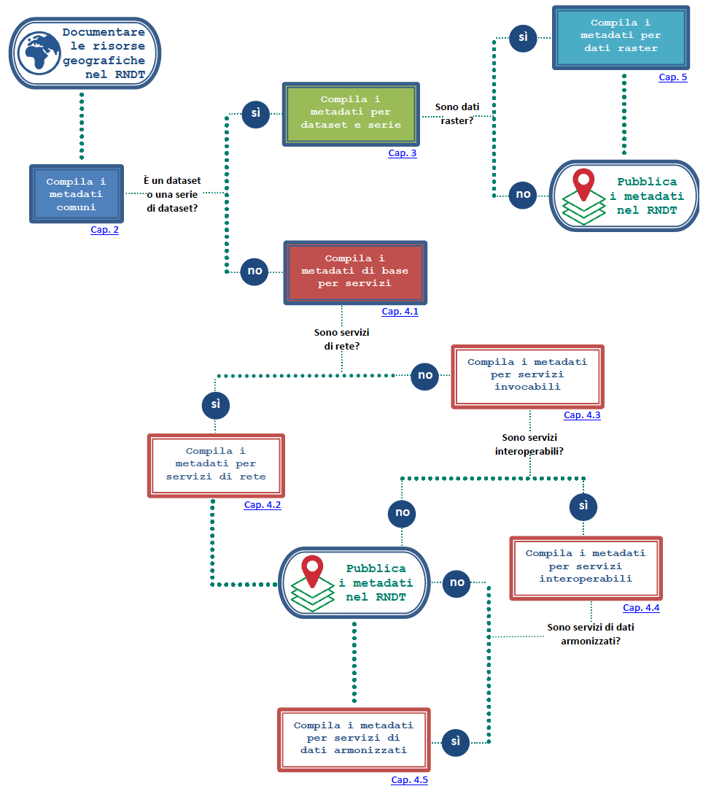

# 2. Guida operativa per la compilazione dei metadati
Questa guida operativa fornisce tutte le istruzioni e indicazioni necessarie per la compilazione dei metadati di dati territoriali e relativi servizi definiti con le Linee Guida RNDT.

---

## **INDICE**

**[COME DOCUMENTARE LE RISORSE GEOGRAFICHE SEGUENDO QUESTA GUIDA OPERATIVA](#metadata-flow)**

**[Riferimenti normativi e tecnici](#rif-norme)**

**[Note di lettura](#note-lettura)**

**[1 INDICAZIONI GENERALI](general-overview)**

**[2 REQUISITI COMUNI PER I METADATI RNDT](common)**

**[3 CLASSI DI CONFORMITÀ PER I DATASET E LE SERIE DI DATASET](datasets-and-series)**

**[4 CLASSI DI CONFORMITÀ PER I SERVIZI DI DATI TERRITORIALI](sds)**

**[5 CLASSI DI CONFORMITÀ PER I DATI RASTER](grid)**

**[6 CLASSI DI CONFORMITÀ PER LE NUOVE ACQUISIZIONI](scheduled-data)**

**[Allegato A - ELENCHI DI CODICI](code-lists)**

---
## <a name=metadata-flow>Come documentare le risorse geografiche seguendo questa guida operativa</a>

Nel diagramma che segue è rappresentato il percorso da seguire nella compilazione dei metadati in base alla tipologia della risorsa.




In sintesi:

**Passo 1** - Compilare i metadati comuni a tutte le risorse geografiche (--> [2 - common](common))

_In caso di dataset o di serie di dataset:_

**Passo 2** - Compilare i metadati per dataset e serie di dataset (--> [3- datasets and series](datasets-and-series))

**Passo 2.1** - In caso di dati raster, compilare i metadati per tale tipologia di dati (--> [5 - grid](grid))

_In caso di servizi di dati territoriali:_

**Passo 3** - Compilare i metadati di base per i servizi di dati territoriali (--> [4.1 - baseline](sds/baseline))

**Passo 3.1** - In caso di servizi di rete, compilare i metadati per tale tipologia di servizi (--> [4.2 - network services](sds/ns))

**Passo 3.2** - In caso di servizi di dati territoriali invocabili, compilare i metadati per tale tipologia di servizi (--> [4.3 - invocable](sds/sds-invocable))

**Passo 3.2.1** - Nel caso in cui i servizi di dati territoriali invocabili siano anche interoperabili, compilare anche i metadati per tale tipologia di servizi (--> [4.4 - interoperable](sds/sds-interoperable))

**Passo 3.2.2** - Nel caso in cui i dati resi disponibili dai servizi di dati territoriali interoperabili siano armonizzati, compilare anche i metadati per tale tipologia di servizi (--> [4.5 - harmonised](sds/sds-harmonised))


## <a name=rif-norme> Riferimenti normativi e tecnici </a>

**[[Direttiva INSPIRE](https://eur-lex.europa.eu/legal-content/IT/TXT/PDF/?uri=CELEX:02007L0002-20190626&from=EN)]** Direttiva 2007/2/CE del Parlamento europeo e del Consiglio, del 14 marzo 2007, che istituisce un&#39;infrastruttura per l&#39;informazione territoriale nella Comunità europea (INSPIRE);

**[[CAD](https://docs.italia.it/italia/piano-triennale-ict/codice-amministrazione-digitale-docs/it/v2017-12-13/index.html)]** Decreto legislativo 7 marzo 2005, n. 82 recante &quot;_Codice dell&#39;amministrazione digitale_&quot;;

**[[Regolamento 1205/2008](https://eur-lex.europa.eu/legal-content/EN/TXT/PDF/?uri=CELEX%3A32008R1205&from=EN)]** Regolamento (CE) n. 1205/2008 della Commissione del 3 dicembre 2008 recante attuazione della direttiva 2007/2/CE del Parlamento europeo e del Consiglio per quanto riguarda i metadati;

**[[Regolamento 976/2009](https://eur-lex.europa.eu/legal-content/IT/TXT/PDF/?uri=CELEX:32009R0976&from=EN)]** Regolamento (CE) n. 976/2009 del 19 ottobre 2009 recante attuazione della direttiva 2007/2/CE del Parlamento europeo e del Consiglio per quanto riguarda i servizi di rete;

**[[Regolamento 1089/2010](https://eur-lex.europa.eu/legal-content/IT/TXT/PDF/?uri=CELEX:02010R1089-20131230&from=EN)]** Regolamento (UE) n. 1089/2010 della Commissione del 23 novembre 2010 recante attuazione della direttiva 2007/2/CE del Parlamento europeo e del Consiglio per quanto riguarda l&#39;interoperabilità dei set di dati territoriali e dei servizi di dati territoriali;

**[[TG MD INSPIRE](https://inspire.ec.europa.eu/id/document/tg/metadata-iso19139)]** Technical Guidance for the implementation of INSPIRE dataset and service metadata based on ISO/TS 19139:2007;

**[ISO 19115]** UNI EN ISO 19115:2005, _Informazioni geografiche – Metadati_ (ISO 19115:2003);

**[ISO 19119]** UNI EN ISO 19119:2006, _Informazioni geografiche – Servizi_ (ISO 19119:2005);

**[ISO 19139]** UNI CEN ISO/TS 19139:2010, _Informazioni geografiche - Metadati - Implementazione di schemi XML_ (ISO/TS 19139:2007);

**[CSW2 AP ISO]** OpenGIS Catalogue Services Specification 2.0.2 - ISO Metadata Application Profile, Version 1.0.0, OGC 07-045, 2007;

**[[LG RNDT](https://geodati.gov.it/geoportale/images/struttura/documenti/LG-RNDT_v.1.0c_bozza.pdf)]** _Linee Guida recanti regole tecniche per la definizione e l&#39;aggiornamento del contenuto del Repertorio Nazionale dei Dati Territoriali_;

**[[LG IPAGPS](https://trasparenza.agid.gov.it/moduli/downloadFile.php?file=oggetto_allegati/191001128380O__OLINEE+GUIDA+IPA.pdf)]**_Linee Guida dell&#39;Indice dei domicili digitali delle pubbliche amministrazioni e dei gestori di pubblici servizi (IPA)_, adottate con la Determinazione n. 97/2019 del 4 aprile 2019.


## <a name=note-lettura> Note di lettura </a>

Nella definizione dei requisiti, delle raccomandazioni e delle istruzioni nel presente documento sono utilizzate le forme verbali analoghe a [TG MD INSPIRE].

Anche le notazioni di classi di conformità, requisiti e raccomandazioni seguono i formati redazionali delle linee guida di cui sopra.

I requisiti sono rappresentati nel modo seguente:

---
**REQUISITO cc.n-req** - **```identificativo univoco del requisito```**

testo del requisito

---

le raccomandazioni nel modo seguente:

---
***Raccomandazione cc.n-rec** - **```identificativo univoco della raccomandazione```***

_testo della raccomandazione_

---

le classi di conformità nel modo seguente:

**Classe di conformità cc** - **```identificativo univoco della classe di conformità```**

_testo della classe di conformità_

mentre gli esempi XML sono indicati nel modo seguente:

```xml
<rndt:esempio_XML>
  <rndt:metadati>
    Tag metadati
  </rndt:metadati>
</rndt:esempio_XML>
```

I numeri dei requisiti ( **cc.n-req** ) e delle raccomandazioni ( **cc.n-rec** ) sono costituiti dal numero della classe di conformità INSPIRE ( **cc** ), come prefisso, e da un numero progressivo ( **n-req** o **n-rec** ). Nei requisiti e nelle raccomandazioni che sono comuni a più classi di conformità il prefisso è indicato con &quot; **C**&quot; (_common_).

Nel caso delle classi di conformità, dei requisiti e delle raccomandazioni specifici per RNDT, quindi definiti in questa guida operativa senza nessuna corrispondenza con quelli INSPIRE, il numero della classe di conformità è preceduto da &quot; **R**&quot;.

Le classi di conformità, i requisiti e le raccomandazioni mutuati dalle linee guida INSPIRE presentano come namespace rispettivamente **metadata/2.0** , **metadata/2.0/req** e **metadata/2.0/rec** , mentre nel caso degli elementi specifici del RNDT il namespace utilizzato è rispettivamente **rndt/metadata/2.0** , **rndt/metadata/2.0/req** e **rndt/metadata/2.0/rec**.

Nel caso dei requisiti INSPIRE, l&#39;identificativo univoco del requisito assume la seguente struttura: **metadata/2.0/req/<id-classe-conformità>/<id-requisito>**, mentre quando si tratta di un requisito specifico del RNDT, allora la struttura è la seguente: **rndt/metadata/2.0/req/<id-classe-conformità>/<id-requisito>**.

Analogamente, nel caso di raccomandazione derivante dalle linee guida INSPIRE, la struttura dell&#39;identificativo univoco della raccomandazione è la seguente: **metadata/2.0/rec/<id-classe-conformità>/<id-raccomandazione>** , mentre nel caso di una raccomandazione specifica del RNDT, la struttura diventa: **rndt/metadata/2.0/rec/<id-classe-conformità>/<id-raccomandazione>**.

---

>Vai a [**1. Indicazioni generali**](general-overview)
